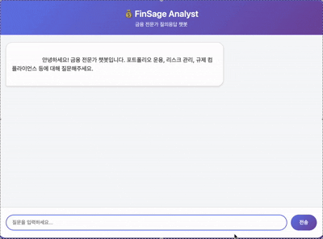

## FinSage Analyst: 금융 전문가 RAG 챗봇

금융감독 보고서·투자자 가이드·은행 정책 등을 인덱싱해 “요즘 금융규제 흐름은?”, “포트폴리오 리밸런싱 기준은?” 같은 전문 질문에 근거 문서와 함께 답변합니다. LangChain RAG + OpenAI LLM + Flask 웹 UI로 구성되며, OpenAI 임베딩 API를 사용해 EC2 등 제한된 환경에서도 가볍게 동작하고 최근 대화 맥락을 기억합니다.

---

### 데모 영상

실행 흐름과 실시간 스트리밍 답변을 짧은 GIF로 확인할 수 있습니다.



---

### 핵심 기능
- **규제/정책 문서 검색**: `data/` 폴더의 `.md/.txt` 문서를 청크 단위로 임베딩 후 FAISS로 검색
- **출처 기반 답변**: 답변 본문에 `[출처번호]` 표기, 하단에 `참고 문서` 목록 자동 출력
- **대화 맥락 기억**: 클라이언트 단에서 최근 5개의 Q/A를 전송해 후속 질문에 맥락 반영
- **실시간 스트리밍**: 토큰 단위로 생성 과정을 보여주어 긴 답변도 기다리는 동안 바로 확인
- **PDF 변환 툴 내장**: `convert_pdf.py`로 대용량 정책 PDF를 Markdown으로 전처리

---

### 설치 및 실행

1. **의존성 설치**
   ```bash
   python -m venv .venv
   source .venv/bin/activate
   pip install -r requirements.txt
   ```
2. **OpenAI API 키 설정**
   ```bash
   export OPENAI_API_KEY=sk-xxxx
   ```
3. **서버 실행**
   ```bash
   python app.py --data-dir data --top-k 5
   ```
   브라우저에서 `http://127.0.0.1:5000`으로 접속합니다.

**주요 옵션**  
`--embedding-model`(기본 `text-embedding-3-small`), `--llm-model`, `--top-k`, `--temperature`, `--openai-api-key`, `--host`, `--port`

---

### 데이터 준비 플로우

1. **PDF 확보**: 금융감독원, 금융투자협회, 한국은행 등에서 규제/정책 PDF 다운로드  
2. **Markdown 변환**
   ```bash
   python convert_pdf.py "data/한국은행 통화신용정책보고서 2024.pdf" \
     -o data/bok_monetary_policy_2024.md
   ```
3. **샘플 유지**: `data/`에 최소 2개의 `.md` 파일을 유지해야 인덱싱이 진행됩니다.  
   원본 PDF는 `.gitignore`에 포함하고, 변환본만 버전에 포함하세요.

**포함된 예시 문서**
- `wealth_portfolio_playbook.md`
- `bank_risk_controls.md`
- `2024년 금융규제 운영규정 실태평가 최종 보고서.md`
- `[요약] 2024 한국 부자보고서.md`
- `별첨자료_금융광고규제가이드라인.md`
- `지속가능금융의 의의.md`

---

### 작동 방식

1. 서버 실행 시 `data/` 내부 문서를 로딩 → 청크 분할 → OpenAI `text-embedding-3-small` 임베딩 생성  
2. FAISS 벡터스토어를 메모리에 생성 (디스크 저장 X)  
3. 질문 수신 → 최근 대화와 문맥을 PromptTemplate에 주입 → OpenAI LLM 호출  
4. `[출처번호]`가 삽입된 답변 + `참고 문서` 리스트 반환  
5. 프론트엔드는 대화 기록을 메모리에 저장해 후속 질문 시 서버로 함께 전송

---

### 프로젝트 구조
```
.
├── app.py                 # Flask 서버 & REST API
├── templates/
│   └── index.html        # 웹 채팅 UI + 대화 기록 관리
├── static/               # 정적 파일 (CSS, JS 등)
├── convert_pdf.py        # PDF → Markdown 변환 스크립트
├── data/                 # 변환된 문서(.md)와 원본 PDF(ignored)
├── src/
│   └── rag_chatbot.py   # LangChain RAG 파이프라인
├── assets/               # 데모 영상 등 리소스
├── requirements.txt
└── README.md
```

---

### 웹 인터페이스 사용법
1. 서버 실행 → `http://127.0.0.1:5000` 접속
2. 금융/규제/투자 질문 입력 (예: “요즘 금융규제 트렌드는?”)
3. 답변 + 참고 문서 확인
4. 동일 세션에서 이전 질문을 기억하므로 후속 질문도 자연스럽게 이어짐
5. 새로고침 시 대화 기록 초기화

---


